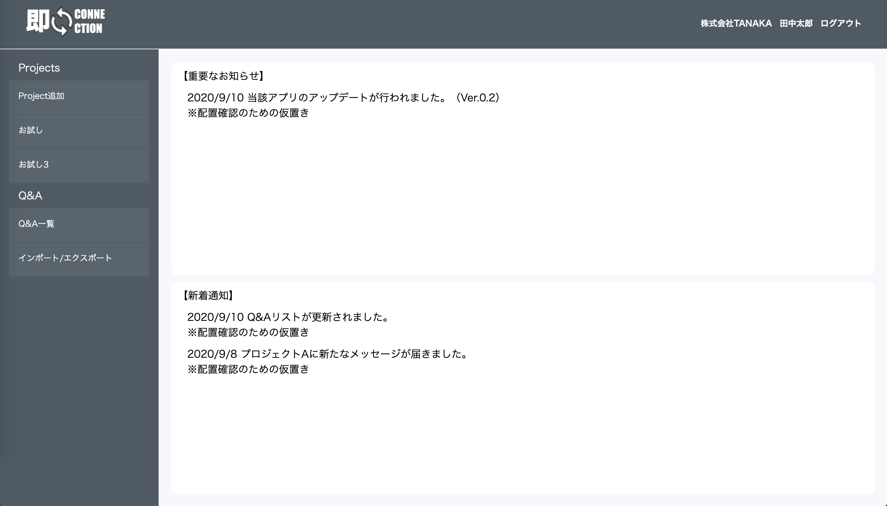
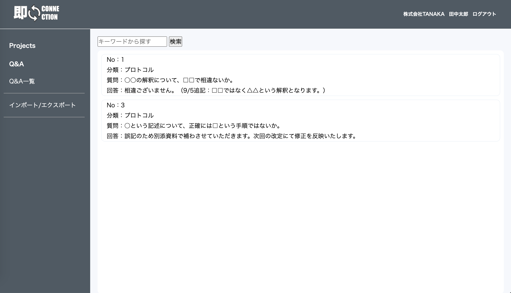
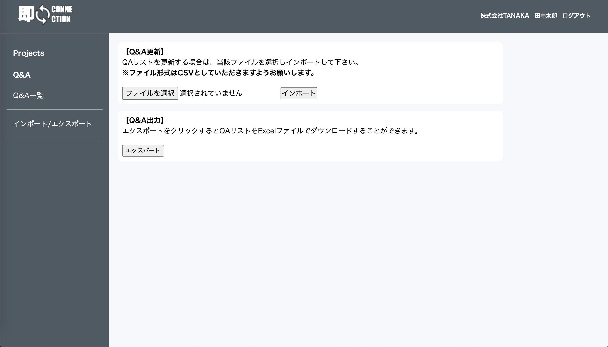
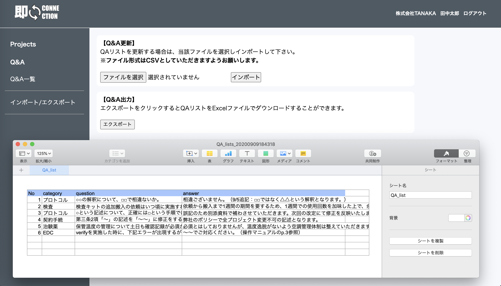
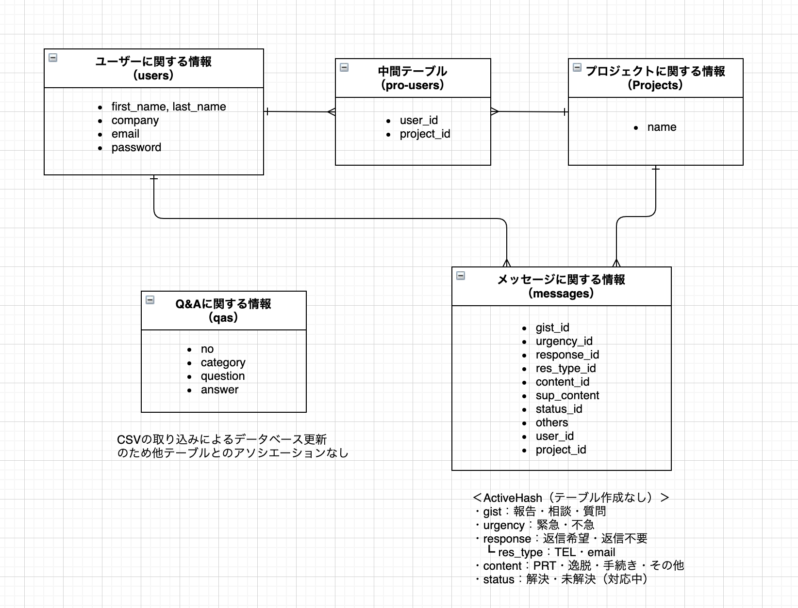

# アプリ名（URL）
即コネ（即CONNECTION）
 （https://soku-conne.herokuapp.com/）

# テスト用接続情報
- Basic認証（ID/Pass）
   ID: admin
   Pass: 2222
- テスト用アカウント
   確認用A
   メールアドレス: aa@aa.com
   パスワード:a11111 
   確認用B
   メールアドレス名: user@user.com
   パスワード: b11111

# 概要
## 第一報のハードルを下げコミュニケーションをより円滑にする
<dl>
  <dt>即コンタクト</dt>
  <dd>用件のみを端的に伝達可能（型式ばったメールを使用しない）</dd>
  <dd>用件が選択式となっており、多忙な合間にパッと送信可能</dd>
  <dt>即検索</dt>
  <dd>取りまとめているQAリストを外部から検索・参照可能</dd>
  <dd>QAリスト（CSV）をインポートするだけでDBへの反映が可能</dd>
  <dd>QAリスト（Excel）をエクスポート可能</dd>
</dl>

# 制作背景(意図)
## 業務における以下課題（ムダやジレンマ）を解決したい
**業務の効率化を図る**
- 型式ばったメールは作成時間がムダ
- 何度も同じ質問を受け、都度回答をする時間がムダ
- 問い合わせ側は相手が回答を持っている場合、待機時間がムダ

**迅速な情報共有**
- 急ぎで情報共有が状況があるも、多忙な時こそ疎かになりがち
- 現場側とマネジメント側で共有タイミングの乖離が起こりがち

# 洗い出した要件（※は今後実装予定）
**ユーザー管理**
- gem:deviseを用いた基本的なユーザー管理機能実装
- 所属企業による表示内容の切替（※）
- ユーザー登録可能者の制限によるセキュリティ強化（※）

**Q&A管理**
- QA一覧表示&キーワード検索
- QAリストインポートによるDB一括保存・更新
- QAリストエクスポート

**プロジェクト毎のメッセージ機能**
- 選択式のメッセージ作成機能
- 既読機能（※）
- 1プロジェクト複数担当者の登録（※）
- 新着通知機能（※）

**その他**
- 統一されたデザイン、視認性の向上のためのビュー調整（※）

# DEMO画面
- ログイン後プラットホーム画面

- メッセージ送信後画面（ビュー仮置き）

- QA一覧

- QAキーワード検索（キーワード：プロトコル にて検索）

- QAインポート・エクスポート画面

- QAエクスポートによるExcel出力

# テーブル設計

## ER図

## users テーブル

| Column     | Type   | Options                   |
| ---------- | ------ | ------------------------- |
| first_name | string | null: false               |
| last_name  | string | null: false               |
| company    | string | null: false               |
| email      | string | null: false, unique: true |
| password   | string | null: false               |

### Association

- has_many :pro_users
- has_many :projects, through: pro_users
- has_many :messages

## projects テーブル

| Column | Type   | Options     |
| ------ | ------ | ----------- |
| name   | string | null: false |

### Association

- has_many :pro_users
- has_many :users, through: pro_users, dependent: :destroy
- has_many :messages, dependent: :destroy

## pro_users テーブル

| Column  | Type       | Options                        |
| ------- | ---------- | ------------------------------ |
| user    | references | null: false, foreign_key: true |
| project | references | null: false, foreign_key: true |

### Association

- belongs_to :user
- belongs_to :project

## messages テーブル

| Column      | Type       | Options                        |
| ----------- | ---------- | ------------------------------ |
| gist_id     | integer    | null: false                    |
| urgency_id  | integer    | null: false                    |
| response_id | integer    | null: false                    |
| res_type_id | integer    |                                |
| content_id  | integer    | null: false                    |
| sup_content | string     |                                |
| status_id   | integer    | null: false                    |
| others      | string     |                                |
| user        | references | null: false, foreign_key: true |
| project     | references | null: false, foreign_key: true |

### Association

- belongs_to :user
- belongs_to :project

# 開発環境
- macOS Catalina 10.15.6
- Ruby 2.6.5
- Ruby on Rails 6.0.3.2
- Heroku
- GitHub